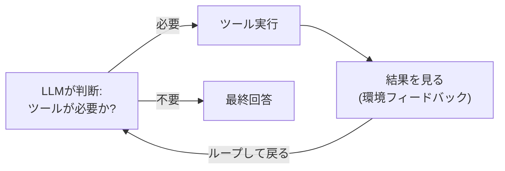

🇬🇧 English version → [README.md](README.md)

# エージェント設計パターン チュートリアル(Ollamaローカル実行版)

Anthropicの ["Building Effective Agents"](https://www.anthropic.com/engineering/building-effective-agents) で紹介されているパターンを、Ollamaで動くローカルLLMを使って実際に動かしながら学ぶチュートリアルです。

外部APIキーは不要です。すべてお使いのマシン上のOllamaに対してリクエストを送ります。

Anthropicの記事は2種類のシステムを区別しています。**Workflow**(制御フロー=何をどの順で実行するかをコード側が事前に決める)と、**Agent**(制御フローそのものをLLMがランタイムで決め、ツールを呼びその結果を見ながらループする)です。このチュートリアルは5つのWorkflowパターン(Step 1〜5)と、Agentパターン自体(Step 6)をカバーしています。

## このチュートリアルで学べること

| # | ファイル | パターン | ひとことで言うと |
|---|---|---|---|
| 1 | `01_prompt_chaining.py` | Prompt Chaining | タスクを順番のステップに分解し、前段の出力を次段の入力にする |
| 2 | `02_parallelization.py` | Parallelization | 複数のLLM呼び出しを同時に走らせる(分割 / 多数決) |
| 3 | `03_routing.py` | Routing | 入力を分類し、専門化されたハンドラーに振り分ける |
| 4 | `04_evaluator_optimizer.py` | Evaluator-Optimizer | 生成 → 評価 → 修正 のループで品質を上げる |
| 5 | `05_orchestrator_workers.py` | Orchestrator-Workers | 司令塔LLMがタスクを動的に分解し、複数のWorker LLMに割り振る |
| 6 | `06_agentic_loop.py` | Agentic Loop | どのツールを・どの順で・いつまで呼ぶかをLLM自身が判断する |

各ファイルは単独で実行できる独立したスクリプトです。番号順に読み進めることを推奨しますが、好きな順番で試しても問題ありません。

---

## Step 0: 事前準備

### 0-1. Ollamaのインストール

まだの場合は [ollama.com](https://ollama.com) からOllamaをインストールしてください。

### 0-2. Ollamaサーバーの起動

```bash
ollama serve
```

すでにバックグラウンドで起動している場合(Macのメニューバーにアイコンがある、Dockerで動いている等)はこの手順は不要です(Dockerの場合は下の補足参照)。

### 0-3. モデルのpull

このチュートリアルはデフォルトで `qwen2.5` を使う設定になっています。

```bash
ollama pull qwen2.5
```

別のモデル(例: `llama3.1`, `gpt-oss:20b` など)を使いたい場合は、各`.py`ファイル冒頭にある以下の行を書き換えてください。

```python
MODEL = "qwen2.5"
```

Step 6(`06_agentic_loop.py`)だけは、OllamaでTool Calling(ツール呼び出し)に対応したモデルが必要です。`qwen2.5` / `llama3.1` / `mistral-nemo` などが対応しています。

### 0-4. 動作確認

```bash
ollama run qwen2.5 "こんにちは"
```

応答が返ってくればセットアップは完了です。Python側は標準ライブラリ(`urllib`)だけでOllamaのREST API (`http://localhost:11434/api/chat`) を呼び出すので、追加の`pip install`は不要です。

**DockerでOllamaを動かしている場合**: コンテナがポート11434をホストに公開していれば(`docker ps`で`0.0.0.0:11434->11434/tcp`のように表示されていれば)、スクリプトは無改造のまま`localhost:11434`にアクセスできます。CLIで動作確認したい場合は`ollama run ...`単体ではなく`docker exec -it <コンテナ名> ollama run qwen2.5 "こんにちは"`を使ってください(`docker -c ollama ...`はdocker *context* を切り替える別のオプションなので無効です)。

---

## Step 1: Prompt Chaining(`01_prompt_chaining.py`)

### コンセプト

1つの大きなタスクを、固定順序の小さなステップに分解します。各ステップの出力が次のステップの入力になります。途中に**ゲート**(プログラム的な検証)を挟み、条件を満たさなければチェーンを打ち切ることもできます。

```
生レビュー → [要点抽出] → [下書き作成] → [ゲート検証] → [仕上げ] → 完成コピー
```

### 実行

```bash
python3 01_prompt_chaining.py
```

### 何が起きているか

- Step 1〜2、4はLLM呼び出し(`ollama_chat()`)
- Step 3の`gate_check()`はLLMを使わない、ただの文字数チェック。**ゲートは必ずしもLLMである必要はない**という点がポイントです
- ゲートで不合格になると、それ以降のステップは実行されずチェーンが中断します

### 試してみよう

`gate_check()`の`min_length`を大きな値(例: `500`)に変えて実行し、チェーンが途中で打ち切られる様子を確認してみてください。

---

## Step 2: Parallelization(`02_parallelization.py`)

### コンセプト

2つの派生パターンがあります。

- **Sectioning(分割)**: 独立したサブタスク(感情分析・トピック抽出・リスク検知)を同時に投げて、結果を統合する
- **Voting(多数決)**: 同じ判定タスクを複数回実行し(temperatureを上げてばらつきを出す)、多数決で最終判断を出す

### 実行

```bash
python3 02_parallelization.py
```

### 何が起きているか

`concurrent.futures.ThreadPoolExecutor`で複数のリクエストを同時に発行しています。ただし注意点として、**Ollamaはローカルの1インスタンスなので、実際の推論はサーバー側でキューイングされ、体感的には順番に処理されることが多い**です。それでも「呼び出し側のコードが並列である」という構造自体は体験できます。

### 試してみよう

`voting_demo()`の`n_votes`を増やしてみたり、`classify_harmful()`の`temperature`を`0.0`に下げてみて、多数決の結果(バラつき方)がどう変わるか比べてみてください。

---

## Step 3: Routing(`03_routing.py`)

### コンセプト

入力をまず分類し、その結果に応じて専門化されたプロンプト(≒担当者)に振り分けます。1つの万能プロンプトに全部やらせるより、カテゴリごとに最適化したほうが精度が上がりやすい、という考え方です。

```
問い合わせ → [分類器] → billing / technical / account / other → 専門ハンドラー
```

### 実行

```bash
python3 03_routing.py
```

### 何が起きているか

- `classify_ticket()`が分類専用のプロンプトでカテゴリを判定
- 各`handle_*()`関数は、カテゴリに応じた異なる`system`プロンプトでLLMを呼び出す(=同じLLMでも役割を変えて使う)

### 試してみよう

`tickets`リストに自分で新しい問い合わせ文を追加し、意図通りに分類されるか確認してみてください。分類がうまくいかない場合は`classify_ticket()`のプロンプトを調整すると精度改善を体感できます。

---

## Step 4: Evaluator-Optimizer Workflow(`04_evaluator_optimizer.py`)

### コンセプト

1つのLLM(Generator)が出力を作り、別の視点(Evaluator)がそれを評価してフィードバックを返します。基準を満たすまで「生成 → 評価 → 修正」のループを繰り返します。

```
生成 → 評価 ─┬─ 合格 → 終了
             └─ 不合格 → フィードバックを添えて再生成 → 評価 → …
```

### 実行

```bash
python3 04_evaluator_optimizer.py
```

### 何が起きているか

- `evaluate_copy()`は「文字数」「商品名の有無」はプログラムで機械的にチェックし、機械的には判定しづらい2つの基準――「行動喚起(CTA)があるか」「トーンが前向きか」――は`_llm_yes_no()`でLLMに判定させています。**判定基準によってLLMを使うかコードで済ませるかを使い分けている**点がポイントです
- 不合格の場合、具体的な指摘(フィードバック)を次の生成プロンプトに埋め込み、再生成させています

> **ローカルで実際に動かして分かったこと:** このスクリプトの初期版では、CTAの有無を「今すぐ」「ぜひ」という単語がそのまま含まれているかで判定していました。しかしこれは脆すぎました――ローカルモデルは「体感しよう」「手に入れよう」のように、これらの単語を一切使わずにCTAを表現することが多く、結果としてループが`max_iterations`に達するまで一度も合格しませんでした。この判定をLLMに任せる(トーン判定と同様に)ことで解決しました。キーワードの完全一致チェックが意味的な評価の代わりにはならない、というこのパターンが扱う設計上のトレードオフを、実例で体感できたケースです。

### 試してみよう

`max_iterations`を`1`にしてみると、1回で基準を満たせなかった場合にどうなるか確認できます。また`evaluate_copy()`に新しいチェック項目(例: 絵文字を含めない、等)を追加してみてください。

---

## Step 5: Orchestrator-Workers Workflow(`05_orchestrator_workers.py`)

### コンセプト

中央のOrchestrator(LLM)が、タスク内容に応じて**動的に**サブタスクを分解します(Step 2のSectioningとの違いは、サブタスクの内容や数が事前に固定されていない点です)。各サブタスクはWorker(LLM)に振られ並列に実行され、最後にOrchestratorが結果を統合します。

```
トピック → [Orchestrator: 計画] → セクション一覧(動的に決定)
                                      ↓ 並列ディスパッチ
                    Worker1  Worker2  Worker3  Worker4
                       ↓        ↓        ↓        ↓
                    [Orchestrator: 統合] → 最終レポート
```

### 実行

```bash
python3 05_orchestrator_workers.py
```

### 何が起きているか

- `orchestrator_plan()`がトピックを見て必要なセクション見出しをLLMに考えさせ、その出力をパースしてリスト化
- `worker()`が各セクションを並列に執筆
- `orchestrator_synthesize()`が結果をまとめて最終レポートに整形

### 試してみよう

`run_orchestrator_workers()`に渡すトピックを変えて(例: `"ダイエットの科学"`など)、Orchestratorが毎回異なるセクション構成を動的に考える様子を確認してみてください。

---

## Step 6: Agentic Loop(`06_agentic_loop.py`)

### コンセプト

これはStep 1〜5とは種類が異なります。それらはすべて**Workflow**——コード側が処理の順序(固定のチェーン、固定の並列分岐、固定のルーティング表、固定の生成/評価ループ、計画してから配布する固定の手順)をあらかじめ決めていました。ここでは、LLM自身が1ターンごとに制御フローを決定します。



各ステップでモデルは0個以上のツールを呼び出し、その実際の結果を見て、次に何をするか(=終わったかどうかも含めて)を判断します。コード側が用意するのは、使えるツールと、暴走を止める安全装置(`max_steps`)だけです。

### 実行

```bash
python3 06_agentic_loop.py
```

### 何が起きているか

- モデルに公開しているツールは3つ: `calculator`(生の`eval`ではなく、`ast`ベースの制限された式評価器——ツールへの入力はLLMが生成する信頼できないデータなので)、`lookup_fact`(小さなインメモリ知識ベース)、`get_text_length`
- `run_agent()`は`tools`を付けてOllamaに会話を送信します。モデルの応答に`tool_calls`が含まれていれば、コード側がそれを実行し、結果を`role: "tool"`のメッセージとして会話に追加してから再度モデルを呼びます。`tool_calls`が含まれていなければ、それはモデルが「完了」を示しているサインなのでループを終了します
- シナリオ1では、2つのツール(`lookup_fact`→`calculator`)を**コードのどこにも指定していない順序**で組み合わせる必要がある質問をしています。この組み立てはモデルが自分で行います
- シナリオ2では知識ベースにない対象を尋ねるため、`lookup_fact`が「見つかりませんでした」を返します。この失敗に対してモデルがどう反応するかに注目してください——これがループの「環境フィードバック」側であり、固定的なWorkflowには絶対にできないことです。なぜならWorkflowの次の一手は、ツールが実際に何を返したかに依存しないからです
- `max_steps`は安全装置です。実際のエージェントは、収束しなければ延々とツールを呼び続ける可能性があります。特にローカルモデルは、大規模なホスト型モデルに比べて「もう完了した」という判断が不安定なことがあります

### 試してみよう

`max_steps`を`1`に下げて、タスクの途中でループが打ち切られる様子を見てみてください。次に4つ目のツール(例: `get_current_year`)を追加し、それが必要な質問をしてみてください——コードの他の部分を変更する必要はありません。新しいツールをいつ使うかはモデルが自分で判断するからです。

---

## トラブルシューティング

**`Ollamaに接続できませんでした` というエラーが出る**
`ollama serve`が起動しているか確認してください。別のターミナルで`ollama run qwen2.5 "test"`が動くか試すと切り分けやすいです。

**モデルが見つからないというエラーが出る**
`ollama pull qwen2.5`(または使いたいモデル名)を実行してください。

**応答が遅い**
ローカルLLMはハードウェア性能に依存します。特にStep 2、5、6は複数回LLMを呼ぶため時間がかかります。より軽量なモデル(例: `qwen2.5:3b`など)に変更すると速くなります。

**分類やパースがうまくいかない**
ローカルの小型モデルは指示追従性がAPIの大型モデルほど高くない場合があります。プロンプトをより明確にする、`temperature`を下げる、出力フォーマットの例を1つ添える、といった調整で改善します。特定の概念の有無(厳密な単語一致ではなく)を判定したい場合は、固定キーワードと照合するよりLLMに判定させる方が安定します(上記Step 4の補足参照)。

**Step 6で「does not support tools」のようなエラーが出る**
すべてのOllamaモデルがTool Callingに対応しているわけではありません。`MODEL`を`qwen2.5` / `llama3.1` / `mistral-nemo`に切り替えてください。

---

## 次のステップ: 実際のAnthropic APIに切り替える

各ファイルの`ollama_chat()`(Step 6では`ollama_chat_with_tools()`)をAnthropic APIの呼び出しに差し替えることで、同じパターン構造のままクラウドの大規模モデルに切り替えられます。

```python
from anthropic import Anthropic
client = Anthropic()

def call_llm(prompt: str, system: str | None = None) -> str:
    resp = client.messages.create(
        model="claude-sonnet-4-5",
        max_tokens=1024,
        system=system,
        messages=[{"role": "user", "content": prompt}],
    )
    return resp.content[0].text
```

パターンの制御フロー(チェーン・並列・分岐・評価ループ・動的分解・エージェンティックなツールループ)自体はモデルに依存しないので、ここまでのコードはほぼそのまま使えます。

## 参考

- Anthropic, "Building Effective Agents": https://www.anthropic.com/engineering/building-effective-agents
- Ollama公式ドキュメント: https://github.com/ollama/ollama/blob/main/docs/api.md
- Ollama Tool Calling: https://ollama.com/blog/tool-support
