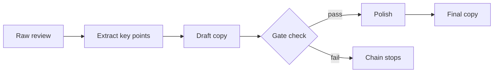
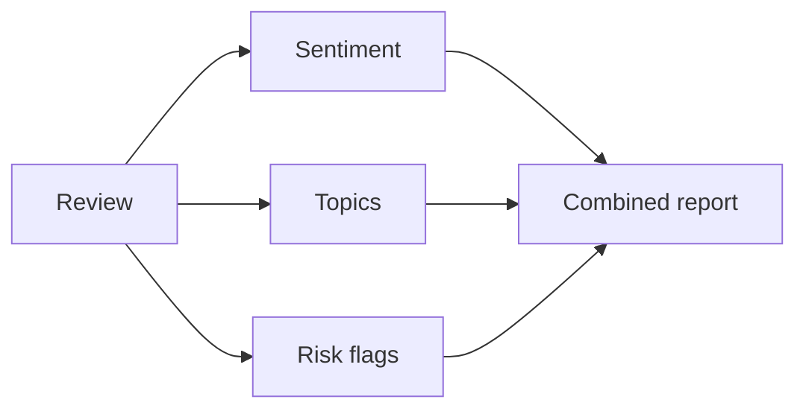
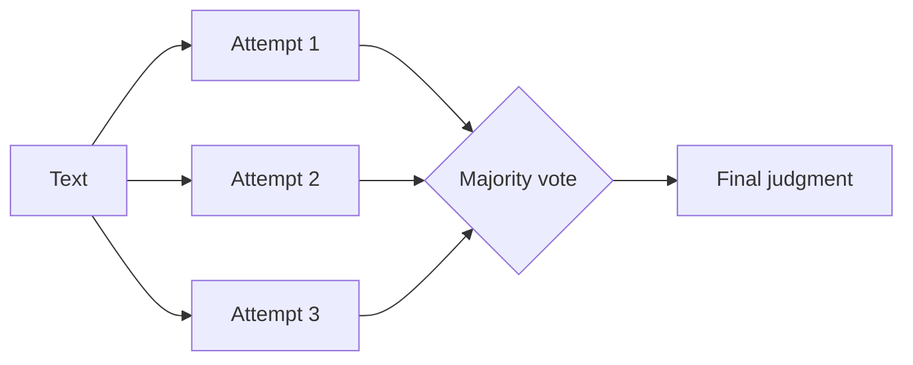
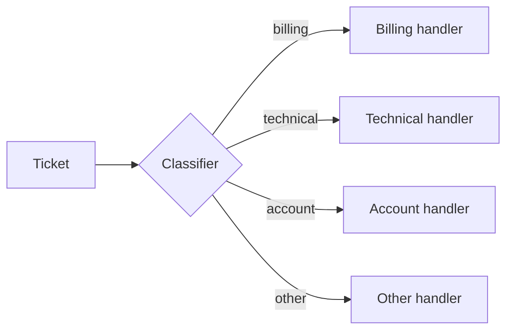
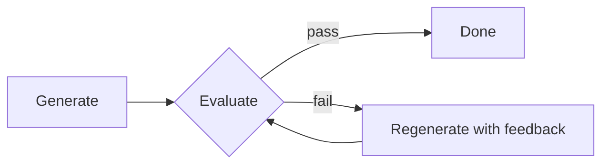
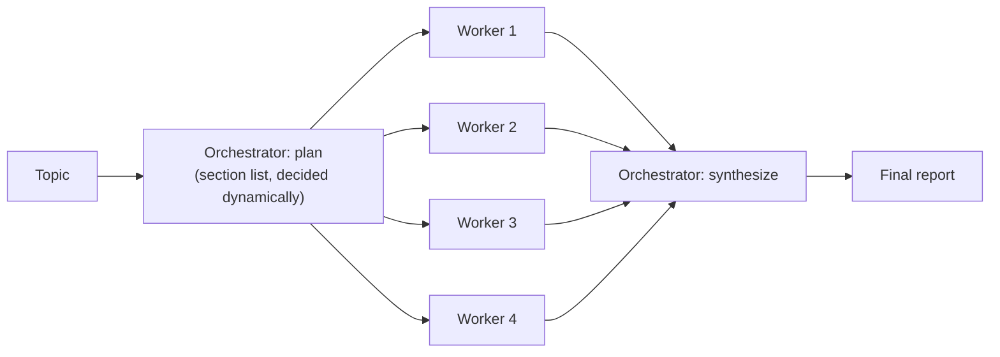
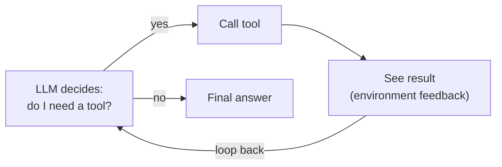

🇯🇵 日本語版はこちら → [README.ja.md](README.ja.md)

# Agent Design Patterns Tutorial (Local Ollama Edition)

A hands-on tutorial for the patterns from Anthropic's ["Building Effective Agents"](https://www.anthropic.com/engineering/building-effective-agents), run entirely against a local LLM via Ollama.

No API key is required — every script talks to Ollama running on your own machine.

Anthropic's article draws a line between two kinds of systems: **Workflows**, where the control flow (what runs, in what order) is decided by your code ahead of time, and **Agents**, where the LLM itself decides the control flow at runtime, calling tools and reacting to their output in a loop. This tutorial covers five workflow patterns (Steps 1–5) plus the agent pattern itself (Step 6).

## What you'll learn

| # | File | Pattern | In one line |
|---|---|---|---|
| 1 | `01_prompt_chaining.py` | Prompt Chaining | Break a task into sequential steps, each feeding the next |
| 2 | `02_parallelization.py` | Parallelization | Run multiple LLM calls at once (sectioning / voting) |
| 3 | `03_routing.py` | Routing | Classify input and dispatch to a specialized handler |
| 4 | `04_evaluator_optimizer.py` | Evaluator-Optimizer | Generate → evaluate → refine in a loop until it passes |
| 5 | `05_orchestrator_workers.py` | Orchestrator-Workers | A lead LLM dynamically breaks up work and dispatches it to worker LLMs |
| 6 | `06_agentic_loop.py` | Agentic Loop | The LLM itself decides which tools to call, in what order, and when to stop |

Each file is a standalone, independently runnable script. Working through them in order is recommended, but feel free to jump around.

---

## Step 0: Prerequisites

### 0-1. Install Ollama

If you haven't already, install Ollama from [ollama.com](https://ollama.com).

### 0-2. Start the Ollama server

```bash
ollama serve
```

Skip this if Ollama is already running in the background (e.g. as a menu-bar app, or inside Docker — see the Docker note below).

### 0-3. Pull a model

These scripts default to `qwen2.5`.

```bash
ollama pull qwen2.5
```

To use a different model (e.g. `llama3.1`, `gpt-oss:20b`), edit this line near the top of each `.py` file:

```python
MODEL = "qwen2.5"
```

Note: Step 6 (`06_agentic_loop.py`) requires a model with **tool calling** support in Ollama. `qwen2.5`, `llama3.1`, and `mistral-nemo` all work; not every model does.

### 0-4. Sanity check

```bash
ollama run qwen2.5 "hello"
```

If you get a response, you're set. The Python side uses only the standard library (`urllib`) to call Ollama's REST API (`http://localhost:11434/api/chat`), so no `pip install` is needed.

**Running Ollama in Docker?** As long as the container publishes port 11434 to the host (e.g. `-p 11434:11434` or `0.0.0.0:11434->11434/tcp` in `docker ps`), the scripts work unmodified — they just hit `localhost:11434`. To run the CLI check above, use `docker exec -it <container_name> ollama run qwen2.5 "hello"` instead of a bare `ollama run` (a bare `docker -c ollama ...` is not valid — `-c` selects a Docker *context*, not a container).

---

## Step 1: Prompt Chaining (`01_prompt_chaining.py`)

### Concept

Decompose one big task into a fixed sequence of smaller steps. Each step's output becomes the next step's input. You can insert a **gate** (a plain, non-LLM check) partway through and abort the chain if it fails.



### Run it

```bash
python3 01_prompt_chaining.py
```

### What's happening

- Steps 1, 2, and 4 are LLM calls (`ollama_chat()`)
- Step 3's `gate_check()` doesn't use the LLM at all — it's just a character-count check. The point: **a gate doesn't have to be an LLM call**
- If the gate fails, the chain stops and later steps never run

### Try it yourself

Bump `gate_check()`'s `min_length` up to something large (e.g. `500`) and re-run to watch the chain get cut short.

---

## Step 2: Parallelization (`02_parallelization.py`)

### Concept

Parallelization runs multiple LLM calls at the same time instead of one after another — either to cut down wall-clock latency, or to make the result more robust by sampling several independent attempts instead of trusting a single one. Two common variants build on this idea:

- **Sectioning**: fire off independent subtasks (sentiment, topics, risk flags) at the same time and combine the results
- **Voting**: run the same judgment task several times (with higher temperature for sampling variety) and take a majority vote

**Sectioning:**



**Voting:**



### Run it

```bash
python3 02_parallelization.py
```

### What's happening

`concurrent.futures.ThreadPoolExecutor` fires several requests concurrently. Note that **Ollama is a single local instance, so the actual inference is usually queued server-side and processed close to sequentially in practice** — but the calling code's structure is genuinely parallel, which is the point of the exercise.

### Try it yourself

Increase `n_votes` in `voting_demo()`, or lower `classify_harmful()`'s `temperature` to `0.0`, and compare how much the votes vary.

---

## Step 3: Routing (`03_routing.py`)

### Concept

Classify the input first, then dispatch to a handler specialized for that category. The idea: a handler tuned for one category tends to beat a single do-everything prompt.



### Run it

```bash
python3 03_routing.py
```

### What's happening

- `classify_ticket()` uses a classification-only prompt to pick a category
- Each `handle_*()` function calls the LLM with a different `system` prompt tailored to that category (same model, different role)

### Try it yourself

Add your own ticket text to the `tickets` list and check whether it's classified as you'd expect. If it's not, tightening the prompt in `classify_ticket()` is a good way to feel the effect of prompt tuning.

---

## Step 4: Evaluator-Optimizer Workflow (`04_evaluator_optimizer.py`)

### Concept

One LLM (the Generator) produces an output; a separate pass (the Evaluator) critiques it and returns feedback. The loop — generate → evaluate → revise — repeats until the output passes.



### Run it

```bash
python3 04_evaluator_optimizer.py
```

### What's happening

- `evaluate_copy()` checks "character count" and "product name present" in plain Python code, and delegates two criteria that are hard to check mechanically — whether a call-to-action is present, and whether the tone is positive — to LLM judgment via `_llm_yes_no()`. **Deciding what needs an LLM and what a simple check can handle is itself part of the design**
- On failure, the specific critique is folded into the next generation prompt

> **Lesson learned from testing this locally:** an earlier version of this script checked for a call-to-action by searching for the literal words "今すぐ" / "ぜひ" in the text. That turned out to be too brittle — a local model phrases calls-to-action many different ways (e.g. "体感しよう", "手に入れよう") without ever using those exact words, so the loop kept failing and hit `max_iterations` without ever passing. Delegating that judgment to the LLM (as it already did for tone) fixed it. It's a good real-world illustration of why keyword matching is a poor substitute for semantic evaluation — and of the design tradeoff this pattern is all about.

### Try it yourself

Set `max_iterations` to `1` and see what happens when the first attempt doesn't pass. Then add a new check to `evaluate_copy()` (e.g. "no emoji allowed").

---

## Step 5: Orchestrator-Workers Workflow (`05_orchestrator_workers.py`)

### Concept

A central Orchestrator (LLM) **dynamically** breaks the task into subtasks based on the input (unlike Step 2's Sectioning, the subtasks aren't fixed in advance — their number and content vary). Each subtask goes to a Worker (LLM), run in parallel, and the Orchestrator synthesizes the results at the end.



### Run it

```bash
python3 05_orchestrator_workers.py
```

### What's happening

- `orchestrator_plan()` asks the LLM to propose section headings for the given topic, then parses that output into a list
- `worker()` drafts each section in parallel
- `orchestrator_synthesize()` assembles everything into the final report

### Try it yourself

Change the topic passed to `run_orchestrator_workers()` (e.g. `"the science of dieting"`) and watch the Orchestrator come up with a different section structure each time.

---

## Step 6: Agentic Loop (`06_agentic_loop.py`)

### Concept

This one is different in kind from Steps 1–5. Those were all **Workflows**: your code decided the order of operations ahead of time (a fixed chain, a fixed set of parallel branches, a fixed routing table, a fixed generate/evaluate loop, a plan-then-dispatch sequence). Here, the LLM decides the control flow itself, turn by turn:



At each step the model can call zero or more tools, see their real output, and decide what to do next — including deciding it's done. Your code only supplies the tools and a safety valve (`max_steps`) to stop runaway loops.

### Run it

```bash
python3 06_agentic_loop.py
```

### What's happening

- Three tools are exposed to the model: `calculator` (a restricted, `ast`-based expression evaluator — not a raw `eval`, since tool inputs are LLM-generated and untrusted), `lookup_fact` (a tiny in-memory knowledge base), and `get_text_length`
- `run_agent()` sends the conversation to Ollama with `tools` attached. If the model's response includes `tool_calls`, the code executes them and appends the results back into the conversation as `role: "tool"` messages, then calls the model again. If the response has no `tool_calls`, that's the model signaling it's done — the loop ends
- Scenario 1 asks a question that requires chaining two tools (`lookup_fact` then `calculator`) in an order **not specified anywhere in the code** — the model works that out on its own
- Scenario 2 asks about something that isn't in the knowledge base, so `lookup_fact` returns "not found." Watch how the model reacts to that failure — this is the "environment feedback" half of the loop, and it's exactly the kind of thing a fixed workflow can't do, because a workflow's next step doesn't depend on what a tool actually returned
- `max_steps` is the safety valve: a real agent can call tools indefinitely if it never converges. Local models in particular can be less reliable than large hosted ones at recognizing "I'm done"

### Try it yourself

Lower `max_steps` to `1` and watch the loop get cut off mid-task. Then add a fourth tool (e.g. a `get_current_year` tool) and ask a question that requires it — no other code changes needed, since the model decides on its own when to reach for a new tool.

---

## Troubleshooting

**"Could not connect to Ollama" error**
Make sure `ollama serve` is running. Try `ollama run qwen2.5 "test"` in another terminal to isolate the problem.

**Model not found error**
Run `ollama pull qwen2.5` (or whichever model name you're using).

**Responses are slow**
Local LLM speed depends on your hardware. Steps 2, 5, and 6 make several LLM calls each, so they take longer. A smaller model (e.g. `qwen2.5:3b`) will speed things up.

**Classification or parsing isn't reliable**
Small local models sometimes follow instructions less reliably than large hosted models. Sharpening the prompt, lowering `temperature`, or adding one example of the expected output format usually helps. If you're checking for the presence of a concept (not an exact phrase), prefer asking the LLM to judge it over matching hardcoded keywords — see the Step 4 note above.

**Step 6 errors with something like "does not support tools"**
Not every Ollama model supports tool calling. Switch `MODEL` to `qwen2.5`, `llama3.1`, or `mistral-nemo`.

---

## Next step: swap in the real Anthropic API

Replace `ollama_chat()` (or `ollama_chat_with_tools()` in Step 6) in any file with an Anthropic API call and the same pattern structure keeps working against a larger, cloud-hosted model:

```python
from anthropic import Anthropic
client = Anthropic()

def call_llm(prompt: str, system: str | None = None) -> str:
    resp = client.messages.create(
        model="claude-sonnet-4-5",
        max_tokens=1024,
        system=system,
        messages=[{"role": "user", "content": prompt}],
    )
    return resp.content[0].text
```

The control flow of each pattern — chaining, parallelizing, branching, evaluate-loop, dynamic decomposition, and the agentic tool loop — is model-agnostic, so almost everything else stays the same.

## References

- Anthropic, "Building Effective Agents": https://www.anthropic.com/engineering/building-effective-agents
- Ollama API docs: https://github.com/ollama/ollama/blob/main/docs/api.md
- Ollama tool calling docs: https://ollama.com/blog/tool-support
